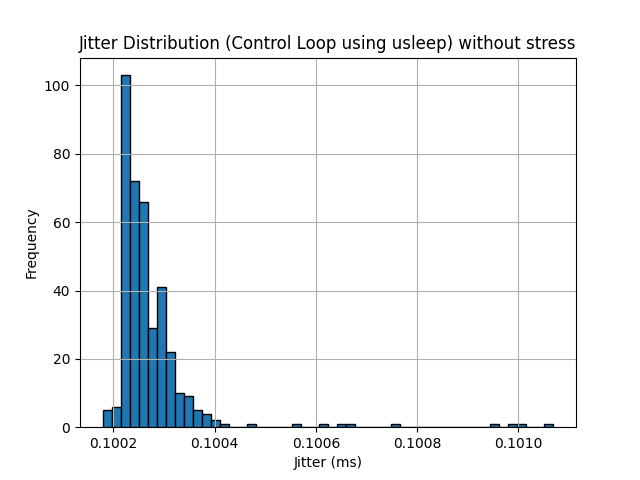
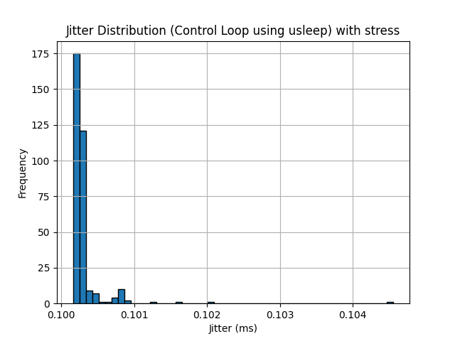
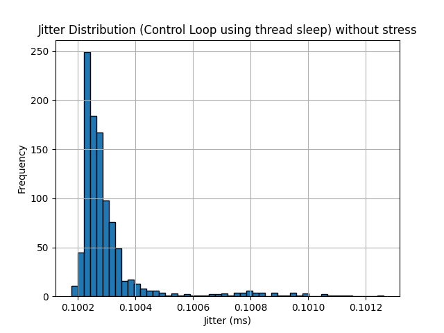
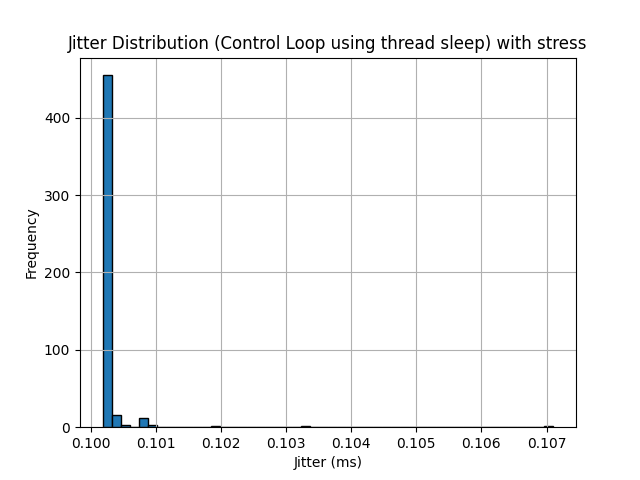
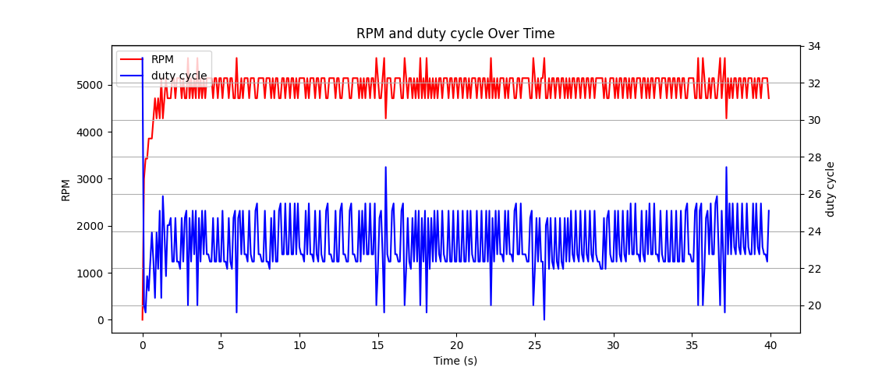
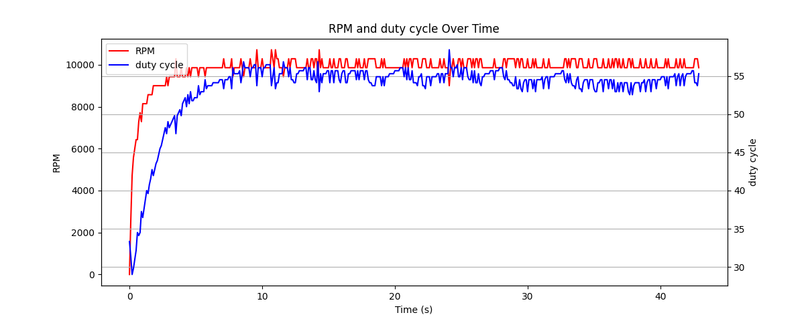

# Part1:  
Measurement of the response time INPUT -> OUTPUT.

The measurement is done with a oszilloscope. Therefore a input pin is connected to the Channel2 and the output to Channel1. With the connection to 3.3V the input pin is set to "high". The response time is defined by the time difference between the rising edge of the input and output.

<!-- ## bash script (bullseye):

CH2: input connected to pin19  
CH1: output connected to pin17  

There is a 1.77 ms delay    -->

## bash script using gpiod

    give permissions to file using: chmod u+x flash_new.sh
    Execute bash script using: ./flash_new.sh & 

    The "&" sends the process to the background and the cpu load can be determined using the "top" command:

    PID USER PR  NI  VIRT   RES   SHR S  %CPU  %MEM  TIME+ CMD 
    2493 pi  20   0  8128  3500  2132 R  22.8   0.8  0:09.64 bash

    pi@rpi-matthiasr24:~/Linux_Motor_Encoder/part1 $ kill 2493
    [1]+  Terminated              ./flash_new.sh

CH2: input connected to pin20   
CH1: output connected to pin17  

If the CPU us stressed the delay gets bigger:

CH2: input connected to pin20   
CH1: output connected to pin17 

If we set the prio of the programm higher (sudo nice -n -10) the delay gets smaller again, beacuse the programm runs more often:

CH2: input connected to pin20   
CH1: output connected to pin17

## programm

    PID USER      PR  NI    VIRT    RES    SHR S  %CPU  %MEM     TIME+ COMMAND                                              
    61128 rpi-sar+  20   0    5252   2688   2560 R 100.0   0.6   0:10.30 gpioread                                             

CH2: input connected to pin20   
CH1: output connected to pin17

If the CPU us stressed the delay gets bigger:

CH2: input connected to pin20   
CH1: output connected to pin17 

If we set the prio of the programm higher (sudo nice -n -10) the delay gets smaller again beacuse it gets called more often:

CH2: input connected to pin20   
CH1: output connected to pin17

But still not as fast as if the CPU load is 0.

## event
    PID USER      PR  NI    VIRT    RES    SHR S  %CPU  %MEM     TIME+ COMMAND                                              
    61132 rpi-sar+  20   0    5256   2816   2688 R  76.8   0.7   0:54.04 gpioevent  

CH2: input connected to pin20   
CH1: output connected to pin17 

If the CPU is stressed there's no difference in the delay.

## LKM interrupt
in module: no measurement for CPU possible

CH2: input connected to pin20   
CH1: output connected to pin17  

If the CPU is stressed there's no difference in the delay.

## Evaluation
Using the Linux Kernel Module Interrupt has no consequences for the CPU load an vice versa the CPU load has no impact to the kernel module. Even if the usage of the LKM interrupt is not the fastest method, it is free from the impact of other programms/ CPU load. 
A real time application is defined by a maximal execution time. Just the interrupt can gurantee a fixed execution time. 

# Part 2

Enabling PWM capabilities with the device tree overlay, didn't work. Therefore we installed a library which does the pwm controll.

    sudo apt install pigpio

The headers are included with:

    #include <pigpio.h>

Running the programm requires admin rights therefore the programm is executed with

    sudo ./speedCtrl

## Jitter measurements
The jitter is measured with a high resolution timer and printed to the output using std::cout

Stress testing the cpu was done with the package stress 

    sudo apt install stress

And then using the following command:

    stress --cpu 1 --timeout 180 &

We evaluated two different methods for timedelay in the control loop:
- using usleep()
- using std::this_thread::sleep_for()

Note: The x-axis scaling is different on all histogram plots

### usleep() without cpu stress

Most time measurements are close together most of them are between 200 us and 400 us, maximum time difference was around 1 ms.  

### usleep() with cpu stress

Stressing the cpu resulted in a broader time spectrum. The majority of the samples have a jitter of 1 ms. However the maximum jitter with the cpu stress is higher than 4 ms.

### thread sleep without cpu stress

Most time measurements are close together most of them are between 200 us and 600 us, maximum time difference was around 1,2 ms. More values can be found between 600 us and 1 ms.

### thread sleep with cpu stress

Stressing the cpu resulted in a broader time spectrum. The majority of the samples have a jitter of 1 ms. However the maximum jitter with the cpu stress is at arround 7 ms.

## Speed
In the next two pictures, the speed is plotted in red and the duty cycle is in blue.

### 5000 rpm

### 10000 rpm

## Stability of the control loop
The control loop worked very good in all test casses. More finetuning would result in even smoother rpm plots. Generally it worked better at higher speeds.  
Tuning the control loop would include measuring the time difference and forwarding this measurement to the controller.  

# Links

Youtube:

Github: https://github.com/UniRoi/Linux_Motor_Encoder
